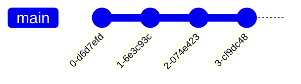

# Branching Strategies

Effective branching strategies are crucial for team coordination. They define how teams organize their work, manage features, and maintain code quality throughout the development lifecycle.

## Feature Branch Workflow

The feature branch workflow is one of the most common and straightforward approaches to branching.

### How It Works

**Process:**
1. Create a new branch for each feature from the main branch
2. Work on the feature in isolation on the feature branch
3. Merge the feature branch back to main when complete
4. Delete the feature branch after successful merge

### Best Practices

**Branch Management**
- Keep branches focused on single features
- Use descriptive branch names (e.g., `feature/user-authentication`)
- Regularly sync with main branch to avoid conflicts
- Delete branches after merging to keep repository clean

**Development Practices**
- Make small, frequent commits on feature branches
- Ensure code is tested before merging
- Use pull requests for code review
- Keep branches short-lived (days or weeks, not months)

**Team Coordination**
- Communicate branch creation and completion
- Use branch protection rules for main branch
- Implement continuous integration on feature branches
- Have clear merge criteria and processes

### When to Use Feature Branch Workflow

**Ideal For:**
- Small to medium teams
- Projects with clear feature boundaries
- Teams practicing continuous integration
- Projects with moderate release frequency

**Less Suitable For:**
- Very large teams with complex coordination needs
- Projects requiring multiple simultaneous releases
- Teams needing strict release management
- Organizations with formal change control processes

## GitFlow Workflow

GitFlow is a more structured approach with multiple branch types designed for larger projects and teams.

### Branch Types and Their Purposes

**main**
- Contains production-ready code
- Tags for releases are created here
- Protected branch with restricted access
- Always stable and deployable

**develop**
- Integration branch for features
- Contains latest developed features
- Next release candidate
- Should always be buildable and testable

**feature/**
- Feature development branches
- Created from and merged back to develop
- Multiple feature branches can exist simultaneously
- Short-lived branches for specific features

**release/**
- Release preparation branches
- Created from develop when preparing for release
- Bug fixes, documentation updates, release metadata
- Merged to both main and develop when complete

**hotfix/**
- Emergency fixes for production issues
- Created from main (production)
- Merged to both main and develop
- Critical fixes that can't wait for next release

### GitFlow Process

**Feature Development**
1. Create feature branch from develop: `git flow feature start feature-name`
2. Work on feature in isolation
3. Complete feature: `git flow feature finish feature-name`
4. Feature is merged back to develop

**Release Preparation**
1. Create release branch from develop: `git flow release start version`
2. Perform release preparation (bug fixes, docs, version bump)
3. Complete release: `git flow release finish version`
4. Release is merged to main and tagged, develop is updated

**Hotfix Process**
1. Create hotfix branch from main: `git flow hotfix start version`
2. Implement emergency fix
3. Complete hotfix: `git flow hotfix finish version`
4. Fix is merged to main and develop, main is tagged

### Advantages of GitFlow

**Structured Approach**
- Clear separation of concerns
- Defined roles for different branch types
- Professional release management
- Suitable for enterprise environments

**Release Management**
- Parallel development and release preparation
- Ability to stabilize releases without blocking development
- Clear release candidates and process
- Support for multiple release versions

**Team Coordination**
- Well-defined processes and workflows
- Clear responsibilities and expectations
- Suitable for larger teams
- Supports formal change management

### Disadvantages of GitFlow

**Complexity**
- Steeper learning curve
- More branches to manage
- Complex merge scenarios
- Can be overwhelming for small teams

**Overhead**
- More process and ceremony
- Longer cycle times for features
- Potential for bottlenecks
- May not suit rapid iteration

**Git History**
- Can create complex merge history
- Harder to follow linear development
- Potential for merge conflicts
- Less clean than simpler workflows

### When to Use GitFlow

**Ideal For:**
- Large teams and organizations
- Projects with scheduled releases
- Enterprise environments
- Projects requiring formal release management

**Less Suitable For:**
- Small teams and startups
- Projects with continuous deployment
- Rapid iteration environments
- Teams preferring simplicity

## GitHub Flow

GitHub Flow is a simpler, more lightweight workflow designed for continuous deployment.

### Key Principles

**Everything in main**
- main branch is always deployable
- Features are developed in branches
- Pull requests for all changes
- Continuous deployment from main

**Simple Process**
1. Create branch from main
2. Make changes and commit
3. Open pull request
4. Review and discuss
5. Deploy to production
6. Merge to main

### Best Practices

**Branch Protection**
- Protect main branch from direct pushes
- Require pull requests for changes
- Ensure CI passes before merge
- Require code review approval

**Continuous Integration**
- Run tests on all branches
- Deploy feature branches to staging
- Automated checks and validations
- Fast feedback loops

**Deployment**
- Deploy pull requests to production
- Use feature flags for gradual rollout
- Monitor deployments closely
- Quick rollback capability

### When to Use GitHub Flow

**Ideal For:**
- Teams practicing continuous deployment
- Web applications and services
- Startups and agile teams
- Projects with frequent releases

**Less Suitable For:**
- Projects with scheduled releases
- Enterprise environments with formal processes
- Mobile applications with app store approval
- Systems requiring extensive testing

## Trunk-Based Development

Trunk-Based Development is an approach where developers work in very short-lived branches or directly in the main branch.

### Core Principles

**Main Branch Development**
- Developers commit directly to main branch
- Very short-lived branches (hours, not days)
- Continuous integration and testing
- Frequent small commits

**Minimal Branching**
- Branches are exceptions, not the rule
- Most work happens in main branch
- Branches for complex features only
- Quick merge back to main

### Advantages

**Simplicity**
- Easy to understand and implement
- Minimal merge conflicts
- Clean linear history
- Reduced coordination overhead

**Speed**
- Fast integration of changes
- Quick feedback loops
- Reduced context switching
- Continuous delivery capability

**Quality**
- Continuous integration testing
- Early detection of issues
- Small, reviewable changes
- Always releasable main branch

### Challenges

**Discipline Required**
- Developers must commit frequently
- Small, incremental changes only
- Comprehensive testing essential
- Strong communication needed

**Team Coordination**
- Requires high team maturity
- Good communication practices
- Conflict resolution processes
- Shared understanding of codebase

### When to Use Trunk-Based Development

**Ideal For:**
- Small, co-located teams
- Projects with high test coverage
- Teams practicing continuous delivery
- Experienced developers

**Less Suitable For:**
- Large, distributed teams
- Projects with low test coverage
- Teams new to continuous integration
- Complex, long-running features

## Choosing the Right Strategy

The choice of branching strategy depends on several factors:

### Team Size and Structure

**Small Teams (1-5 developers)**
- Feature Branch Workflow or GitHub Flow
- Simple processes with minimal overhead
- Focus on speed and agility

**Medium Teams (6-20 developers)**
- Feature Branch Workflow or GitFlow
- More structure for coordination
- Balance between flexibility and control

**Large Teams (20+ developers)**
- GitFlow or enterprise workflows
- Formal processes and controls
- Emphasis on release management

### Project Type and Domain

**Web Applications**
- GitHub Flow or Trunk-Based Development
- Continuous deployment capability
- Rapid iteration and feedback

**Mobile Applications**
- Feature Branch Workflow or GitFlow
- App store approval cycles
- Scheduled release management

**Enterprise Systems**
- GitFlow or custom enterprise workflows
- Formal change management
- Compliance and audit requirements

### Release Cadence

**Continuous Deployment**
- GitHub Flow or Trunk-Based Development
- Multiple deployments per day
- Automated testing and deployment

**Scheduled Releases**
- GitFlow or Feature Branch Workflow
- Regular release cycles
- Release stabilization periods

**Infrequent Releases**
- GitFlow or enterprise workflows
- Long release cycles
- Extensive testing and validation

### Organizational Culture

**Agile and Innovative**
- GitHub Flow or Trunk-Based Development
- Emphasis on speed and experimentation
- Continuous improvement mindset

**Structured and Process-Driven**
- GitFlow or enterprise workflows
- Emphasis on control and predictability
- Formal processes and documentation

## Hybrid Approaches

Many teams adopt hybrid approaches that combine elements from different strategies:

### GitFlow Lite

**Characteristics:**
- Simplified GitFlow without release branches
- Feature branches from main
- Direct deployment from main
- Hotfix branches for emergencies

**Benefits:**
- Simpler than full GitFlow
- Suitable for continuous deployment
- Maintains structure for features
- Good for medium-sized teams

### GitHub Flow with Release Branches

**Characteristics:**
- GitHub Flow for most features
- Release branches for stabilization
- Tagged releases from main
- Hotfix process for emergencies

**Benefits:**
- Flexibility for continuous deployment
- Support for scheduled releases
- Balance between agility and structure
- Suitable for growing teams

### Custom Workflows

**Characteristics:**
- Tailored to specific team needs
- Combination of best practices
- Evolution based on experience
- Continuous improvement

**Benefits:**
- Perfect fit for team context
- Addresses specific pain points
- Evolves with team maturity
- Maximizes team effectiveness

## Implementation Best Practices

### Tooling and Automation

**Branch Protection**
- Protect main and develop branches
- Require pull requests for changes
- Ensure CI passes before merge
- Require code review approval

**Automation**
- Automated branch creation
- Automated testing and validation
- Automated deployment pipelines
- Automated cleanup of old branches

**Monitoring and Metrics**
- Track branch lifetime and merge rates
- Monitor merge conflict frequency
- Measure deployment frequency and success
- Track team velocity and throughput

### Team Practices

**Documentation**
- Document branching strategy clearly
- Provide examples and guidelines
- Create decision trees for common scenarios
- Maintain runbooks for processes

**Training and Onboarding**
- Train team members on chosen workflow
- Provide hands-on practice sessions
- Create cheat sheets and reference materials
- Mentor new team members

**Continuous Improvement**
- Regular retrospectives on workflow effectiveness
- Experiment with process improvements
- Adapt strategy as team and project evolve
- Share lessons learned with other teams

## Conclusion

Branching strategies are not one-size-fits-all solutions. The right strategy depends on team size, project type, release cadence, and organizational culture.

Key considerations when choosing and implementing a branching strategy:

- **Start Simple**: Begin with a simple approach and evolve as needed
- **Team Buy-in**: Ensure the team understands and supports the chosen strategy
- **Tooling Support**: Use appropriate tools to enforce and automate the workflow
- **Continuous Improvement**: Regularly review and adapt the strategy based on experience

The goal is to enable effective collaboration while maintaining code quality and supporting the team's development pace. A well-chosen and properly implemented branching strategy becomes an enabler rather than a bottleneck for development.