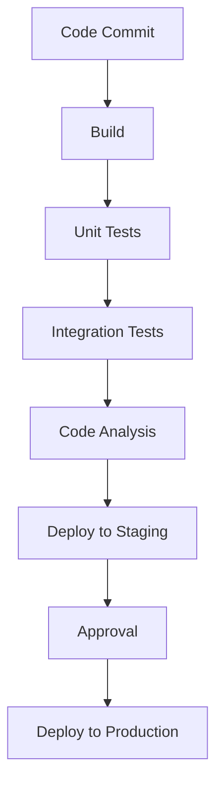

# Continuous Integration

Continuous Integration (CI) automates the build and testing process, forming a critical component of modern configuration management. CI ensures that code changes are automatically built, tested, and validated, providing rapid feedback to developers and maintaining code quality throughout the development lifecycle.

## CI Pipeline Components

A typical CI pipeline consists of several interconnected components that work together to automate the software delivery process:



### Build Automation

**Purpose**: Compile and package code into deployable artifacts

**Key Activities**:
- Source code compilation and linking
- Dependency resolution and management
- Asset compilation and optimization
- Package creation and versioning
- Artifact storage and management

**Best Practices**:
- Use containerized builds for consistency
- Implement incremental builds for speed
- Cache dependencies to reduce build times
- Version all build artifacts
- Store artifacts in reliable repositories

**Common Tools**:
- **Maven/Gradle**: Java build automation
- **npm/yarn**: JavaScript package management
- **pip/poetry**: Python dependency management
- **Cargo**: Rust build system and package manager
- **Docker**: Containerization and packaging

### Automated Testing

**Purpose**: Automatically validate code correctness and quality

**Testing Levels**:
- **Unit Tests**: Test individual components in isolation
- **Integration Tests**: Test component interactions
- **End-to-End Tests**: Test complete user workflows
- **Performance Tests**: Test system performance characteristics
- **Security Tests**: Test for security vulnerabilities

**Test Automation Strategies**:
- **Test-Driven Development (TDD)**: Write tests before code
- **Behavior-Driven Development (BDD)**: Test from user perspective
- **Acceptance Test-Driven Development (ATDD)**: Test against requirements
- **Continuous Testing**: Run tests continuously throughout development

**Testing Tools**:
- **JUnit/TestNG**: Java testing frameworks
- **pytest/unittest**: Python testing frameworks
- **Jest/Mocha**: JavaScript testing frameworks
- **Selenium/Cypress**: End-to-end testing
- **JMeter/Gatling**: Performance testing

### Code Quality Analysis

**Purpose**: Ensure code meets quality standards and best practices

**Analysis Types**:
- **Static Analysis**: Analyze code without executing it
- **Dynamic Analysis**: Analyze code during execution
- **Security Scanning**: Identify security vulnerabilities
- **Code Coverage**: Measure test coverage effectiveness
- **Complexity Analysis**: Assess code complexity metrics

**Quality Metrics**:
- **Code Coverage**: Percentage of code covered by tests
- **Cyclomatic Complexity**: Measure of code complexity
- **Code Duplication**: Amount of duplicated code
- **Technical Debt**: Accumulated design and maintenance issues
- **Security Vulnerabilities**: Known security issues and risks

**Analysis Tools**:
- **SonarQube**: Comprehensive code quality platform
- **ESLint/TSLint**: JavaScript/TypeScript linting
- **Pylint/Flake8**: Python code analysis
- **Clang-Tidy**: C/C++ static analysis
- **GitHub Advanced Security**: Integrated security scanning

## CI Best Practices

### Pipeline Design

**Fast Feedback Loops**
- Design pipelines for speed and efficiency
- Parallelize independent tasks where possible
- Provide immediate feedback on failures
- Optimize for developer productivity
- Minimize wait times and bottlenecks

**Fail Fast Approach**
- Run quick checks first (linting, syntax)
- Fail immediately on critical issues
- Stop pipeline on first failure
- Provide clear error messages
- Enable quick fixes and re-runs

**Clear Visibility**
- Make pipeline status visible to all team members
- Provide detailed logs and artifacts
- Show progress and estimated completion times
- Highlight failures and their causes
- Enable easy access to build results

**Reliability and Consistency**
- Use containerized environments for consistency
- Implement retry mechanisms for transient failures
- Monitor pipeline health and performance
- Maintain pipeline infrastructure and dependencies
- Document pipeline configuration and processes

### Testing Strategy

**Comprehensive Test Coverage**
- Test at multiple levels (unit, integration, end-to-end)
- Cover both happy paths and edge cases
- Include performance and security testing
- Test across different environments and configurations
- Maintain high test coverage standards

**Test Organization**
- Organize tests by type and purpose
- Use clear naming conventions
- Group related tests together
- Separate fast from slow tests
- Implement test suites for different scenarios

**Test Data Management**
- Use test data factories and fixtures
- Manage test environments and databases
- Implement test data cleanup
- Use mocking and stubbing appropriately
- Ensure test data consistency and reliability

**Test Performance**
- Optimize test execution speed
- Parallelize test execution where possible
- Use test prioritization and selection
- Implement test caching and incremental testing
- Monitor and improve test performance over time

### Security Integration

**Security Scanning**
- Scan dependencies for known vulnerabilities
- Analyze code for security issues
- Check for secrets and sensitive information
- Validate security configurations
- Generate security reports and alerts

**Compliance Checking**
- Verify compliance with security standards
- Check against regulatory requirements
- Validate security policies and procedures
- Generate compliance documentation
- Audit security practices and controls

**Security Testing**
- Perform static application security testing (SAST)
- Conduct dynamic application security testing (DAST)
- Implement interactive application security testing (IAST)
- Run penetration testing and security assessments
- Test security controls and defenses

## CI/CD Platforms

### Jenkins

**Overview**: Open-source automation server with extensive plugin ecosystem

**Strengths**:
- Highly customizable and flexible
- Large plugin ecosystem (1000+ plugins)
- Self-hosted option for full control
- Mature and stable platform
- Strong community support

**Weaknesses**:
- Steeper learning curve
- Requires more maintenance
- Can be complex to set up and configure
- Resource-intensive
- UI can be outdated

**Best Use Cases**:
- Complex enterprise environments
- Organizations needing full control
- Projects with unique requirements
- Teams with DevOps expertise
- Environments with specific compliance needs

**Key Features**:
- Pipeline as Code (Jenkinsfile)
- Distributed builds for scalability
- Extensive plugin ecosystem
- Role-based access control
- Build pipeline visualization

### GitHub Actions

**Overview**: Integrated CI/CD platform within GitHub ecosystem

**Strengths**:
- Seamless GitHub integration
- YAML-based configuration
- Free for public repositories
- Growing marketplace of actions
- Modern, user-friendly interface

**Weaknesses**:
- Limited to GitHub repositories
- Can be expensive for private repositories
- Less flexible than Jenkins
- Dependency on GitHub platform
- Limited self-hosting options

**Best Use Cases**:
- GitHub-hosted projects
- Small to medium teams
- Projects needing quick setup
- Teams already using GitHub
- Open source projects

**Key Features**:
- Workflow automation with YAML
- Pre-built actions for common tasks
- Matrix builds for testing multiple configurations
- Environment management and secrets
- Artifact storage and deployment

### GitLab CI/CD

**Overview**: Integrated CI/CD platform within GitLab DevOps platform

**Strengths**:
- Complete DevOps platform integration
- Built-in container registry
- Auto DevOps features
- Good for enterprises
- Comprehensive feature set

**Weaknesses**:
- Tied to GitLab platform
- Can be complex for simple projects
- Resource-intensive
- Learning curve for advanced features
- Pricing can be expensive for large teams

**Best Use Cases**:
- Organizations using GitLab
- Enterprise environments
- Projects needing comprehensive DevOps
- Teams wanting integrated solution
- Organizations with compliance requirements

**Key Features**:
- YAML-based pipeline configuration
- Auto DevOps for automated workflows
- Built-in monitoring and metrics
- Environment management
- Integrated security scanning

### CircleCI

**Overview**: Cloud-native CI/CD platform focused on speed and simplicity

**Strengths**:
- Fast build execution
- Simple configuration
- Good performance
- Modern architecture
- Strong Docker support

**Weaknesses**:
- Limited self-hosting options
- Can be expensive for large teams
- Less flexible than Jenkins
- Smaller ecosystem
- Limited enterprise features

**Best Use Cases**:
- Fast-paced development teams
- Projects prioritizing speed
- Teams using Docker extensively
- Small to medium organizations
- Projects with straightforward CI needs

**Key Features**:
- YAML-based configuration
- Docker-first architecture
- Parallel execution for speed
- Workflow orchestration
- Resource class optimization

## Advanced CI Techniques

### Pipeline as Code

**Definition**: Managing CI pipeline configuration in version control alongside application code

**Benefits**:
- Version control for pipeline changes
- Code review for pipeline modifications
- Reproducible builds across environments
- Infrastructure as Code principles
- Easier testing and validation of pipelines

**Implementation Approaches**:
- **Jenkinsfile**: Jenkins Pipeline as Code
- **GitHub Actions YAML**: Workflow configuration in code
- **GitLab CI YAML**: Pipeline configuration in repositories
- **CircleCI Config**: Configuration as code
- **Custom DSLs**: Domain-specific languages for pipelines

**Best Practices**:
- Store pipeline configuration in repository
- Use modular and reusable pipeline components
- Implement pipeline testing and validation
- Document pipeline configuration and processes
- Use environment-specific configurations

### Matrix Builds

**Definition**: Running builds across multiple configurations and environments

**Use Cases**:
- Testing across multiple operating systems
- Validating against different runtime versions
- Testing with different dependency versions
- Building for different target architectures
- Testing across different browsers and devices

**Implementation Examples**:
```yaml
# GitHub Actions Matrix Example
strategy:
  matrix:
    os: [ubuntu-latest, windows-latest, macos-latest]
    node-version: [14.x, 16.x, 18.x]
    python-version: [3.8, 3.9, 3.10]
```

**Best Practices**:
- Limit matrix size to avoid excessive resource usage
- Use conditional logic for specific configurations
- Implement parallel execution for efficiency
- Monitor and optimize matrix build performance
- Use matrix builds for cross-platform validation

### Caching and Optimization

**Build Caching**:
- Cache dependencies between builds
- Cache build artifacts and intermediate results
- Implement incremental builds
- Use content-addressable storage
- Optimize cache invalidation strategies

**Dependency Caching**:
- Cache package manager dependencies
- Use lock files for reproducible builds
- Implement dependency optimization
- Cache Docker layers and images
- Use private package registries

**Performance Optimization**:
- Parallelize independent tasks
- Use incremental builds and testing
- Optimize test execution order
- Implement build pipeline monitoring
- Use resource-efficient build agents

## CI in Different Environments

### Monorepo Management

**Challenges**:
- Large codebase with multiple projects
- Complex dependency relationships
- Long build times for full repository
- Coordination across multiple teams
- Resource management and optimization

**Strategies**:
- **Affected Builds**: Build only changed components
- **Build Graphs**: Define dependency relationships
- **Incremental Builds**: Build only what changed
- **Parallel Execution**: Run independent builds in parallel
- **Resource Allocation**: Optimize resource usage

**Tools and Platforms**:
- **Bazel**: Build tool designed for monorepos
- **Nx**: Smart build system for monorepos
- **Lerna**: Tool for managing JavaScript monorepos
- **Turborepo**: High-performance build system
- **Rush**: Microsoft's monorepo manager

### Microservices Architecture

**Challenges**:
- Multiple independent services to build and test
- Service dependencies and integration testing
- Deployment coordination and versioning
- End-to-end testing complexity
- Monitoring and observability across services

**Strategies**:
- **Independent Pipelines**: Separate CI for each service
- **Pipeline Orchestration**: Coordinate service deployments
- **Contract Testing**: Validate service interfaces
- **Integration Testing**: Test service interactions
- **Canary Deployments**: Gradual service rollout

**Best Practices**:
- Implement service-specific CI pipelines
- Use containerization for consistency
- Implement service mesh for communication
- Monitor service health and performance
- Use feature flags for controlled releases

### Enterprise Environments

**Challenges**:
- Complex compliance and security requirements
- Multiple teams and stakeholders
- Legacy system integration
- Strict change management processes
- Audit and documentation requirements

**Strategies**:
- **Comprehensive Pipeline Design**: Include all required checks
- **Multi-Stage Approvals**: Implement approval workflows
- **Audit Trail**: Maintain detailed logs and records
- **Environment Management**: Strict environment controls
- **Integration with Enterprise Systems**: Connect to existing tools

**Enterprise Features**:
- Role-based access control
- Audit logging and reporting
- Integration with enterprise directories
- Compliance checking and validation
- High availability and disaster recovery

## Monitoring and Metrics

### Pipeline Performance Metrics

**Build Duration**:
- Average build time across projects
- Build time trends over time
- Comparison against SLAs
- Identification of performance bottlenecks
- Optimization opportunities and improvements

**Success Rate**:
- Pipeline success percentage
- Failure rate by project and team
- Common failure patterns and causes
- Time to recovery from failures
- Impact on development velocity

**Resource Utilization**:
- CPU, memory, and disk usage
- Network bandwidth consumption
- Build agent utilization rates
- Cost optimization opportunities
- Resource planning and capacity management

### Quality Metrics

**Test Results**:
- Test pass/fail rates
- Test coverage trends
- Flaky test identification
- Test performance metrics
- Test effectiveness measurements

**Code Quality**:
- Static analysis results
- Code complexity metrics
- Security vulnerability counts
- Technical debt measurements
- Code quality trends over time

**Deployment Metrics**:
- Deployment frequency
- Deployment success rate
- Time to deployment
- Rollback frequency
- Deployment failure analysis

### Business Metrics

**Development Velocity**:
- Feature delivery rate
- Time from idea to production
- Bug fix turnaround time
- Team productivity metrics
- Innovation and improvement metrics

**User Impact**:
- Feature adoption rates
- User satisfaction scores
- Performance impact on users
- Reliability and uptime metrics
- Customer feedback and issues

**Business Value**:
- ROI on CI/CD investments
- Cost savings from automation
- Risk reduction measurements
- Competitive advantage metrics
- Business agility improvements

## Conclusion

Continuous Integration is a fundamental practice in modern software development that enables teams to:

- **Deliver Faster**: Automate build and test processes for rapid feedback
- **Improve Quality**: Catch issues early through automated testing and analysis
- **Reduce Risk**: Validate changes thoroughly before deployment
- **Increase Collaboration**: Provide visibility into development progress
- **Scale Effectively**: Support growing teams and complex projects

The key to successful CI implementation is to start simple, iterate based on team needs, and continuously improve processes and tooling. By investing in CI, organizations can significantly improve their development practices, software quality, and business outcomes.

Remember that CI is not just about tools and automation—it's about creating a culture of quality, collaboration, and continuous improvement that enables teams to deliver better software faster and more reliably.